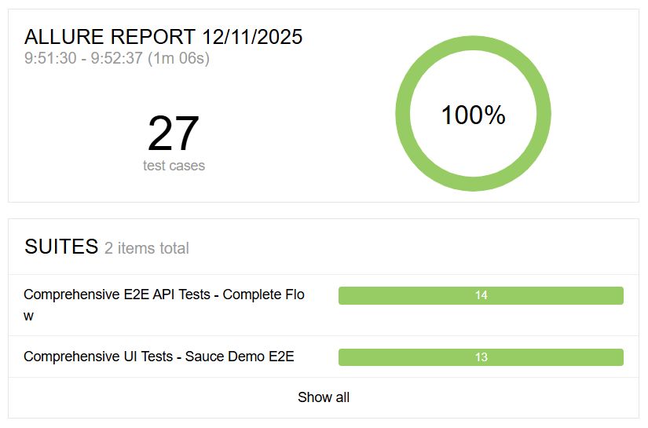
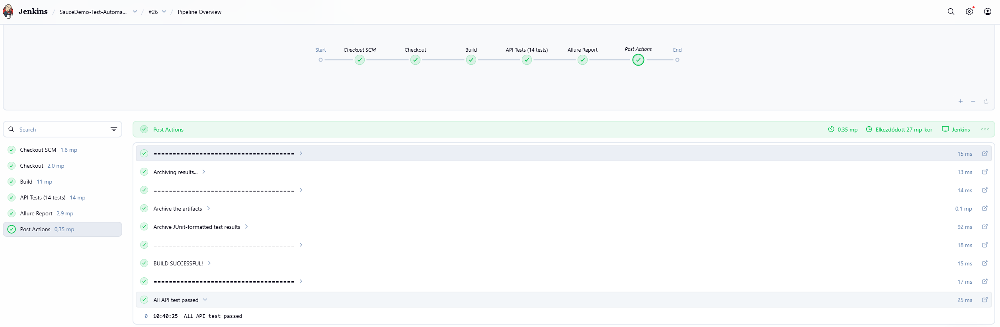

# Software Test Automation

---

## Overview

This project demonstrates a **professional-grade test automation framework** for e-commerce applications. It includes:

- **14 API Tests** - RESTAssured, CRUD operations, negative testing
- **13 UI Tests** - Selenium WebDriver, Page Object Model, explicit waits
- **3 E2E Flows** - Complete checkout scenarios
- **Framework Features** - Config management, logging, helper utilities, CI/CD integration

**Target Application for UI tests**: [SauceDemo](https://www.saucedemo.com/)

**API Backend**: Electronics Store API

---

### Done parts from Requirements.pdf

| ID           | Description                                                                                                                                                                                                                                                                                           | Points   |
|--------------|-------------------------------------------------------------------------------------------------------------------------------------------------------------------------------------------------------------------------------------------------------------------------------------------------------|----------|
| **C1**       | Project builds and runs tests with gradle test                                                                                                                                                                                                                                                        | 4        |
| **C2**       | Central configuration (cofig file, config.properties, API baseUrl, UI baseUrl, No hardcoded URL)                                                                                                                                                                                                      | 2        |
| **C3**       | JUnit tags/ categories + running (API tests: gradle clean test -Ptag=api, UI tests: gradle clean test -Ptag=ui )                                                                                                                                                                                      | 2        |
| **A1**       | Inventory endpoints (test 01- GET, test 02- PUT), Cart endpoints (test 03- POST, test 04- GET, test 05- POST), Order Endpoints (test 06- POST, test 07- GET, test 08- PUT), Payment endpoints (test 09- GET, test 10- POST, test 11- GET), Negative tests (test 12- GET, test 13- PUT, test 14- POST) | 6        |
| **A2**       | Uses RestAssured consistency in RequestSpecFactory.java and in services                                                                                                                                                                                                                               | 2        |
| **A3**       | FULL CRUD happy-path coverage with E2E CRUD flow (test 06, test 07, test 08, test 09)                                                                                                                                                                                                                 | 8        |
| **A4**       | Negativ tests (test 12, test 13, test 14)                                                                                                                                                                                                                                                             | 2        |
| **A5**       | RequestSpecFactory/RespondSpecFactory.java to avoid repetition                                                                                                                                                                                                                                        | 4        |
| **A6**       | POJOS: CartItemRequest.java, CreateOrderRequest.java, ReserveInventoryRequest.java, UpdateOrderStatusRequest.java, ProcessPaymentRequest.java)                                                                                                                                                        | 3        |
| **A7**       | Complete E2E flow: Inventory (Reserve) → Cart (Add) → Cart (Calculate) → Order (Create) → Order (Verify) → Payment (Process)                                                                                                                                                                          | 5        |
| **U1**       | Basic UI tests: 01_LOGIN_PAGE_LOADS, 02_SUCCESSFUL_LOGIN, 03_INVALID_LOGIN, 04_PRODUCTS_LOAD, 05_PRODUCTS_NAMES                                                                                                                                                                                       | 5        |
| **U2**       | Reusable locators in LoginPage.java, ProductPage.java, CartPage.java                                                                                                                                                                                                                                  | 2        |
| **U3**       | Component-level coverage: 01_LOGIN_PAGE_LOADS, 02_SUCCESSFUL_LOGIN, 03_INVALID_LOGIN, 04_PRODUCTS_LOAD, 05_PRODUCTS_NAMES, 06_ADD_TO_CART, 07_PRODUCT_PRICE, 08_CART_PAGE, 09_REMOVE_FROM_CART, U4_WAITS, 10_E2E_COMPLETE_CHECKOUT, 11_E2E_MULTIPLE_PRODUCTS, 12_E2E_CANCEL_CHECKOUT                  | 7        |
| **U4**       | Waits in RandomDelayHelper.java, BasePage.java (Explicit waits), and usage in Tests                                                                                                                                                                                                                   | 3        |
| **U5**       | POM in LoginPage.java, ProductPage.java, CartPage.java, CheckoutPage.java                                                                                                                                                                                                                             | 4        |
| **U6**       | BasePage + inheritance                                                                                                                                                                                                                                                                                | 5        |
| **U7**       | E2E in 10_E2E_COMPLETE_CHECKOUT, 11_E2E_MULTIPLE_PRODUCTS, 12_E2E_CANCEL_CHECKOUT                                                                                                                                                                                                                     | 4        |
| **F1**       | Extended configuration (Separate API + UI)                                                                                                                                                                                                                                                            | 4        |
| **F2**       | Separated setup (ComprehensionApiTest.java, ComprehensiveUiTest.java)                                                                                                                                                                                                                                 | 4        |
| **F3**       | Reusable helpers: RequestSpecFactory.java reused in InventoryService, CartService, OrderService, PaymentService & RandomDelayHelper.java reused in BasePage                                                                                                                                           | 3        |
| **F4**       | Optional utilities layer in TestLogger.java                                                                                                                                                                                                                                                           | 2        |
| **Q1,Q2,Q3** | Hopefully the code is understandable                                                                                                                                                                                                                                                                  | 8        |
| **J1**       | Jenkinsfile job                                                                                                                                                                                                                                                                                       | 4        |
| **J2**       | Jenkinsfile stored in repository but not contains UI tests.                                                                                                                                                                                                                                           | 3/6      |
| **J3,J4**    | Not sure                                                                                                                                                                                                                                                                                              | ?/4      |
| **G1,G2,G3** | Multiple commits, but not that meaningful, one feature branch                                                                                                                                                                                                                                         | ?/6      |
| **R1,R2**    | Allure tests are integrated, Basic logging is implemented: TestLogger.java, and Logging is used in Tests                                                                                                                                                                                              | 9        |
| **D1,D2**    | Detailed README                                                                                                                                                                                                                                                                                       | 8        |
| **SKIPPED**  | F5, R3                                                                                                                                                                                                                                                                                                |          |
| **TOTAL**    |                                                                                                                                                                                                                                                                                                       | **100+** |

---

## Project Structure

```
api-testing-demo-java_starter/
│
├── 📄 build.gradle              # Gradle build configuration
├── 📄 settings.gradle           # Gradle settings
├── 📄 README.md                 # This file
├── 📄 Jenkinsfile               # Jenkins pipeline configuration
│
├── 📁 src/
│   ├── 📁 main/java/
│   │   └── 📁 com/testautomation/
│   │       ├── 📁 api/          # API testing classes
│   │       ├── 📁 models/       # POJO models (Product, Order, etc.)
│   │       ├── 📁 config/       # Configuration & properties
│   │       └── 📁 utils/        # Utility classes
│   │
│   └── 📁 test/java/
│       └── 📁 com/testautomation/
│           ├── 📁 pages/        # Page Object Model classes
│           ├── 📁 helpers/      # Test helpers (logging, setup)
│           └── 📄 ComprehensiveUiTest.java  # UI & E2E tests
│           └── 📄 ComprehensiveApiTest.java # API tests
│
├── 📁 src/test/resources/
│   └── 📄 config.properties     # Test configuration (baseUrl, timeouts)
│
└── 📁 build/
    └── reports/allure-report/   # Allure report artifacts

```

---

## Prerequisites

### Required Software

| Tool               | Version |
| ------------------ | ------- |
| **Java**           | 17+     |
| **Gradle**         | 8.0+    |
| **Chrome Browser** | Latest  |
| **Git**            | Latest  |

---

## Installation & Setup

### 1. Clone Repository

```bash
# Clone the repository
git clone https://github.com/osztobanyipeter1/SoftwareTestAutomation.git
cd api-testing-demo-java_starter
```

### 2. Install Dependencies

Gradle automatically downloads all dependencies from `build.gradle`:

```bash
# Download all project dependencies
gradle build --refresh-dependencies

# Or just resolve dependencies
gradle resolveDependencies
```

## Running Tests

(Use Windows PowerShell)

### Run Electronic store Java project

```bash
# Find the place where you have the file
cd {location}

# Run it
java -jar electronics-store-0.0.1-SNAPSHOT.jar
```

#### WARNING: Restart the electronic-store file, because after many use the data will be out of order and the API calls will FAIL.

### Run Tests

(Use PowerShell and the location where you cloned the git repository)

#### WARNING: Befure the UI tests, make sure that you are logged out from the SauceDemo application in Chrome browser, and the cart is empty.

```bash
#Run both API and UI tests
cd api-testing-demo-java_starter
gradle clean test --no-build-cache

# API tests
#14/14 has to work
cd api-testing-demo-java_starter
gradle clean test -Ptag=api --no-build-cache

# UI tests
#13/13 has to work
cd api-testing-demo-java_starter
gradle clean test -Ptag=ui --no-build-cache
```
Last test run:


### Allure report

```bash
# For Allure reports, use the following to check it after API or UI tests or both of them
allure serve build/allure-results
```

---

## Project Architecture

### Layer 1: Framework & Configuration

```
config.properties
  ↓
ConfigManager
  ↓
DriverFactory (WebDriver management)
```

### Layer 2: Page Object Model (UI Tests)

```
BasePage (common methods, waits)
  ↓
├── LoginPage
├── ProductPage
├── CartPage
└── CheckoutPage
```

### Layer 3: Test Helpers

```
TestLogger (structured logging)
TestSetupHelper (cart cleanup, state reset)
RandomDelayHelper (random delays)
```

### Layer 4: Test Classes

```
ComprehensiveApiTest
ComprehensiveUiTest
```

### Layer 5: Reporting

```
Allure Annotations (@Test, @DisplayName, @Step)
  ↓
Test Results (JSON/XML)
  ↓
Allure Report (HTML)
```

---

## Dependencies

### Build & Test Framework

- **Gradle 8.0+** - Build automation
- **JUnit 5.9+** - Testing framework
- **Java 17+** - Language runtime

### Selenium & Web Automation

- **Selenium 4.15+** - Browser automation
- **WebDriverManager 5.6+** - Automatic ChromeDriver management
- **Implicit/Explicit Waits** - Reliable element waiting

### API Testing

- **RestAssured 5.3+** - RESTful API testing
- **JSON-Path** - JSON response parsing
- **AssertJ 3.24+** - Fluent assertions

### Reporting & Logging

- **Allure 2.21+** - Test reporting framework
- **SLF4J + Logback** - Structured logging
- **JUnit 5 Annotations** - Test metadata

### Full Dependencies List

See `build.gradle`:

```gradle
testImplementation 'org.junit.jupiter:junit-jupiter:5.9.3'
testImplementation 'org.seleniumhq.selenium:selenium-java:4.15.0'
testImplementation 'io.github.bonigarcia:webdrivermanager:5.6.2'
testImplementation 'io.rest-assured:rest-assured:5.3.2'
testImplementation 'org.assertj:assertj-core:3.24.1'
testImplementation 'io.qameta.allure:allure-junit5:2.21.0'
testImplementation 'org.slf4j:slf4j-api:2.0.7'
testImplementation 'ch.qos.logback:logback-classic:1.4.11'
```

---

# Jenkins CI/CD Pipeline Setup Guide

---

## Pipeline summary

Jenkins pipeline for **automatic API testing** for all git push in selected GitHub repository.

```
Pipeline Stages:
├──  Checkout      → Git repository clone
├──  Build         → Gradle project build
├──  API Tests     → 14 automated tests ( 100% PASS)
└──  Allure Report → Test results visualization
```

## Jenkins Install and Configuration

### 1 Prerequisites

- **Jenkins** (v2.387+)
- **Git** (v2.40+)
- **Java** (v21 LTS)
- **Gradle** (v9.0.0+)
- **Allure** (test reporting)

### 2 Jenkins Job Setup

#### **A. New Pipeline Job**

```
Jenkins Dashboard → New Item → Enter Name: "SauceDemo-Test-Automation"
→ Select "Pipeline" → OK
```

#### **B. GitHub Repository Configuration**

```
Configure → General:
  GitHub project
  Project url: https://github.com/osztobanyipeter1/SoftwareTestAutomation
```

#### **C. Build Triggers**

```
Build Triggers → GitHub hook trigger for GITScm polling OR Poll SCM
```


#### **D. Pipeline Definition**

```
Definition: Pipeline script from SCM
SCM: Git
Repository URL: https://github.com/osztobanyipeter1/SoftwareTestAutomation.git
Branch: */main
Script Path: api-testing-demo-java_starter/Jenkinsfile
```

Then Save the configuration.

---

### Manual Start from Jenkins

```
Jenkins → SauceDemo-Test-Automation → Build Now
```
Make sure that you have Allure installed and configured in Jenkins global tools. And also added as PATH variable in the system.

---

## Jenkins Pipeline Overview

Only contains the API calls and Allure. UI calls run into fails.



## Author

**Peter Osztobanyi - HKQ2Y1** - Pazmany Peter Catholic University
[GitHub](https://github.com/osztobanyipeter1)

---
